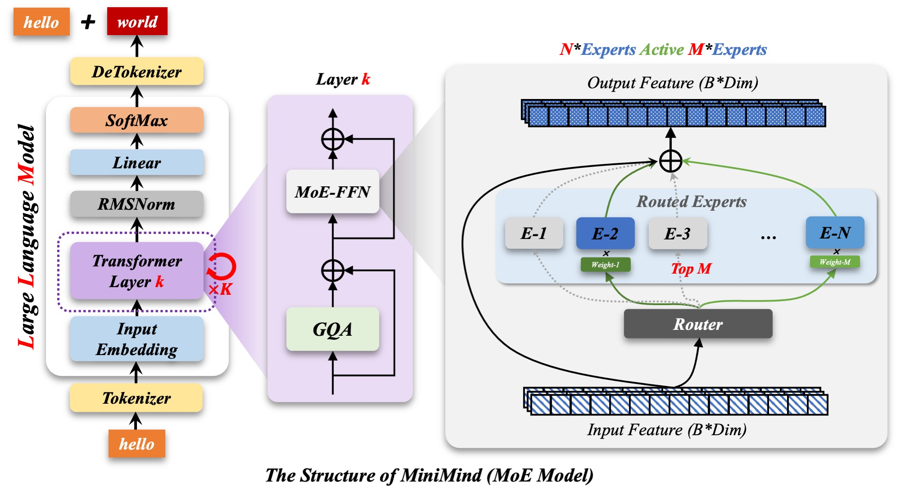

[中文](README.md) | [English](README_EN.md)

# Minimind: Personal Implementation from Scratch

Original project: https://github.com/jingyaogong/minimind

### Requirements

- **Python**: 3.12
- **PyTorch**: 2.9.1
- **CUDA**: 12.8
- **pandas**
- **NumPy**
- **datasets**: `pip install datasets`
- **SwanLab**: `pip install swanlab`
- **Transformers**: `pip install transformers`

**⏱️ Training Information**

- **Hardware**: NVIDIA GeForce RTX 4090 (24 GB)
- **Estimated training time**: Approximately 2 hours
- **Stage 1 — Pretrained model**: `pretrain_512.pth` (base architecture weights)
- **Stage 2 — Final chat model**: `full_sft_512.pth` (complete version with full-parameter fine-tuning and reinforcement learning)

## Data Preparation

This project requires a high-quality Chinese corpus for the pretraining stage.

### 1. Download the Datasets

Download the pretraining dataset, `pretrain_hq.jsonl`, from the following page:

- [Download the Minimind dataset from Hugging Face](https://huggingface.co/datasets/jingyaogong/minimind_dataset/tree/6b952cc50427c84eac543d0b38a8066208433847)

**Note:** After completing pretraining, download the fine-tuning dataset, `sft_mini_512.jsonl`, from the same page to prepare for the subsequent training stage.

### 2. Dataset Location

After downloading the two files, move them into the `dataset/` directory in the project root. The resulting directory structure should be:

```text
dataset/
├── pretrain_hq.jsonl
└── sft_mini_512.jsonl
```

---

## Model Architecture

### Base Architecture


### Mixture-of-Experts (MoE) Architecture

