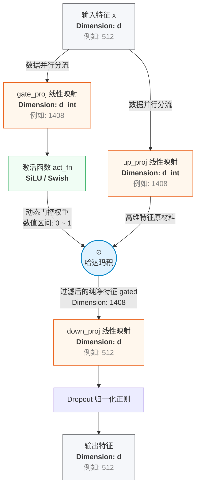

本文档的主要目的，是解析本文档中的大语言模型中核心组件的算法原理、数学推导及其在 PyTorch 中的底层代码实现。

# RMSNorm:
---
在讲 RMSNorm 之前，我们先复习一下 LayerNorm，也就是 Attention 那篇文章中用到的归一化方法。在我们训练模型的时候，数据经过一层层的神经网络后，数值分布容易变得极其夸张（要么极大，要么极小），这会导致模型梯度爆炸或消失。而 LayerNorm 的作用就是把每一层输出的数据重新拉回一个标准的、稳定的范围内。

**LayerNorm 完整公式如下：**

$$
y = \frac{x - \mu}{\sqrt{\sigma^2 + \epsilon}} \odot \gamma + \beta
$$

**其中参数计算为：**
* **均值 (Mean)：**
  $$\mu = \frac{1}{d} \sum_{i=1}^{d} x_i$$
* **方差 (Variance)：**
  $$\sigma^2 = \frac{1}{d} \sum_{i=1}^{d} (x_i - \mu)^2$$

**注：** $d$ 是向量维度， $\epsilon$ 是防止分母为零的极小数， $\gamma$ 和 $\beta$ 是可学习的缩放和平移参数， $\odot$ 表示逐元素相乘。

---

但是，在后续研究人员的实验中，他们发现去均值这步对模型的表现没有实际贡献，真正让模型稳定下来的是缩放操作。所以使用 RMSNorm 可以省略掉计算均值的操作，节省了算力。

**RMSNorm 核心公式如下：**

$$
y = \frac{x}{\text{RMS}(x)} \odot \gamma
$$

**其中均方根 (Root Mean Square) 计算为：**

$$
\text{RMS}(x) = \sqrt{\frac{1}{d} \sum_{i=1}^{d} x_i^2 + \epsilon}
$$

**注：** 相比 LayerNorm，RMSNorm 移除了计算均值 $\mu$ 的平移操作，同时也去掉了偏置参数 $\beta$ ，仅保留了方差缩放部分。

```python
def _norm(self, x):
        #-1是取最后一个维度也就是沿着特征维度进行归一化
        #rsqrt 是取反平方根（1/sqrt)
        return x * torch.rsqrt(x.pow(2).mean(-1, keepdim = True) + self.eps)

    def forward(self, x):
        # Weight 就是公式中的gamma
        return self.weight * self._norm(x.float()).type_as(x)
```
# RoPE & YaRN: 
---
## 第一部分：为什么放弃绝对位置编码？

在标准的 Transformer中，位置编码是**绝对的**（Absolute Positional Encoding）。

* **做法：** 构造一个与 Token Embedding 维度相同的正弦/余弦矩阵，然后**直接相加**：

$$
X_{final} = X_{token} + PE_{absolute}
$$

* **痛点：** 注意力机制的核心是计算 Query 和 Key 的内积 $Q \cdot K^T$。当我们把位置信息“加”进去后，内积展开会产生交叉项。虽然模型能隐式学到一些位置关系，但在数学性质上，这种加法**不能完美地表达相对距离(既m - n)**。对于语言模型来说，“词与词之间的相对距离”往往比“词在绝对的第几个位置”重要得多。

为了让注意力机制的点积受相对位置（m - n）影响，RoPE 诞生了。

---

## 第二部分：RoPE (Rotary Position Embedding) + 检查是否需要开启YaRN（外推）

RoPE 的核心思想非常优雅：**不要用加法，用旋转矩阵做乘法。**

在一个二维平面上，如果你把向量 $\mathbf{q}$ 旋转角度 $m\theta$，把向量 $\mathbf{k}$ 旋转角度 $n\theta$。当计算它们的点积（夹角）时，结果只和相对角度 (m - n)θ 有关！
公式如下：
$$\langle q_m, k_n \rangle = (R_m q)^\top (R_n k) = q^\top R_m^\top R_n k = q^\top R_{n-m} k$$

### 1. 基础旋转频率的计算
在进行旋转之前，我们需要为不同维度分配不同的基础旋转频率 $\theta_i$。RoPE 的原始公式定义为：
$$\theta_i = 10000^{-2i/d} = \frac{1}{10000^{2i/d}}$$
其中 $d$ 是特征维度（即代码中的 `dim`），2i 是偶数维度的索引。

代码完美复刻了这一公式：
```python
freqs = 1.0 / rope_base ** (torch.arange(0, dim, 2).float() / dim)
```

### 如果开启了YaRN —— 突破上下文长度的封印（外推）

假设 minimind 模型最初只在 2048 的长度下训练。现在你想让它理解 8192 长度的文本。如果直接输入，位置索引会超纲（模型没见过 2048 之后的旋转角度），模型会直接崩溃。

以前的做法是**线性插值（PI）**：把 0-8192 强行等比例压缩回 0-2048。但这样会导致原本清晰的高频局部信息变得模糊。

**YaRN (Yet another RoPE extensioN) 的方法是：按波长（频率）分治。**

我们来逐行拆解代码中 `precompute_freqs` 的 YaRN 核心逻辑：

### 1. 计算波长与频率边界
代码中提取了几个关键参数：`beta_fast = 32.0` 和 `beta_slow = 1.0`。
接着，通过解方程计算出频率的对数分布 `inv_dim`，然后找到了插值的上下界 `low` 和 `high`。

```python
# inv_dim 反推当前维度的频率衰减因子
inv_dim = lambda b : (dim * math.log(orig_max / (b * 2 * math.pi))) / (2 * math.log(rope_base))

low, high = (
    max(math.floor(inv_dim(beta_fast)), 0),
    min(math.ceil(inv_dim(beta_slow)), dim // 2 - 1)
)
```
### 数学推导补充：
这个 `lambda` 表达式是 YaRN 最核心的数学转换。YaRN 不按绝对维度索引来一刀切，而是根据**波长（Wavelength）**来划分高低频：
1. **波长定义**：第 $i$ 个维度的波长 $\lambda_i = \frac{2\pi}{\theta_i} = 2\pi \cdot \text{base}^{2i/d}$。
   
2. **核心阈值**：YaRN 通过**原始最大长度 $L$**（`orig_max`）与**波长 $\lambda_i$** 的比值 $\beta$（即代码中的 `b`）来界定边界：

$$
\beta = \frac{L}{\lambda_i}
$$

1. **反推索引**：将波长公式代入并求解维度索引 $i$：
   $$\beta = \frac{L}{2\pi \cdot \text{base}^{2i/d}}$$
   两边取自然对数化简后得到：
   $$i = \frac{d \cdot \ln\left(\frac{L}{2\pi \beta}\right)}{2 \cdot \ln(\text{base})}$$

这里的max, min意义是：
* **高频部分（短波长）：** 负责极小范围内的注意力（比如邻近的两个词）。YaRN 认为，局部词的相对关系绝对不能被压缩打乱。
* **低频部分（长波长）：** 负责全局上下文。这部分可以直接按比例 `factor` 进行缩放，因为全局注意力的容错率更高。

### 2. 核心平滑过渡：Ramp 函数
在找到了高频和低频的边界后，YaRN 计算了一个 `ramp` 变量。

```python
# ramp = i - low / high - low
# dim // 2 是因为旋转位置编码（RoPE）是把维度两两分组来做cos, sin
# torch.clamp(计算结果, 0, 1)，意思是“强制截断”！ 如果算出来的结果小于 0，强制变成 0，如果算出来的结果大于 1，强制变成 1
ramp = torch.clamp(
    (torch.arange(dim // 2, device = freqs.device).float() - low) / max(high - low, 0.001), 0, 1,
)
```
* 对于**高频区**（局部细节）：`ramp` 值为 0。
* 对于**低频区**（全局宏观）：`ramp` 值为 1。
* 对于**中频区**（过渡区）：`ramp` 是一个 0 到 1 之间的渐变小数（比如 0.5）。

### 3. 施加缩放因子
最后是这行决定性的代码，它是 YaRN 的灵魂：
```python
freqs = freqs * (1 - ramp + ramp / factor)
```

你可以代入数字感受一下这层数学逻辑的精妙：
* 当处于高频（`ramp = 0`）时，公式等于 `freqs * 1`。**原封不动，保护局部细节！**
* 当处于低频（`ramp = 1`）时，公式等于 `freqs / factor`。**直接进行插值缩放，扩展全局视野！**
* 中间频率则是两者平滑混合。

### 注意：
* 如果开启了外推，后续freqs_cos, freqs_sin会受影响，如果没有开启，则跳过YaRN，直接到计算freqs_cos, freqs_sin
---

freqs后续需要计算每个词，每个维度的“绝对旋转角度”
```python
#计算每个词，每个维度的“绝对旋转角度” 角度 = 位置 * 频率，注意outer 方法是把第一个数组的每一个元素，拿去跟第二个数组里的所有元素分别相乘
freqs = torch.outer(t, freqs).float()
```

### 维度拼接与注意力温度补偿
在算好全部频率后，代码需要将其展开并加入温度补偿：

```python
freqs_cos = torch.cat([torch.cos(freqs), torch.cos(freqs)], dim = -1) * attn_factor
freqs_sin = torch.cat([torch.sin(freqs), torch.sin(freqs)], dim = -1) * attn_factor
```
* **为什么要 `torch.cat` 拼接两次？**
  前面算出的 `freqs` 长度只有 $d/2$。因为前面提到的 `rotate_half` 把特征直接劈成左右两半，我们需要把角度张量自我复制拼接成 `[freqs, freqs]`，使其总长度恢复成 $d$。这样，左半边的第 $k$ 个元素和右半边的第 $k$ 个元素，就能精准对齐同一个旋转角度。
* **为什么要乘 `attn_factor`？**
  当上下文被强行拉长后（比如从 2k 拉到 32k），Query 和 Key 内积的数量也会成倍增加，导致 Softmax 后的注意力分布变得极其“尖锐”且局部化。乘以 `attn_factor`（注意力温度补偿系数）是为了微调内积大小，强制让 Softmax 恢复到模型最初训练时的平滑分布（即保持 Attention Entropy 不变）。
---

## 第三部分 - 运用旋转位置编码
### 工程上的 Trick：`rotate_half`
原始的 RoPE 是把特征维度两两分组 $(x_0, x_1), (x_2, x_3)$ 来做二维旋转。但在深度学习框架（如 PyTorch）中，交替索引会打断内存连续性，影响 GPU 上的算子执行效率。

看看model.py中 `apply_rotary_pos_emb` 里的 `rotate_half` 函数。它没有两两相邻分组，而是**直接把向量劈成前后两半**。

```python
# 假设我们有一个隐藏层向量 x，里面有 4 个数字：[A, B, C, D]。
# rotate_half 将其变成了 [-C, -D, A, B]
def rotate_half(x):
    return torch.cat((-x[..., x.shape[-1] // 2:], x[..., : x.shape[-1] // 2]), dim = -1)
```

为什么要变成 `[-C, -D, A, B]`？
这实际上是在复现二维平面旋转公式：

$$
\begin{aligned}
x' &= x \cos(\theta) - y \sin(\theta) \\
y' &= x \sin(\theta) + y \cos(\theta)
\end{aligned}
$$

通过把前半部分当做 $x$，后半部分当做 $y$ (旋转前)，巧妙地利用 `torch.cat` 和元素级乘法（element-wise multiplication）完成了旋转操作。这种做法避免了复杂的矩阵乘法，这对大模型的推理速度至关重要。


# GQA 与 KV Cache
---
## 1. 从 MHA 到 GQA：注意力机制的演进

在介绍 GQA (Grouped-Query Attention) 之前，我们先回顾一下传统的多头注意力机制（MHA），以及为什么现在的大模型逐渐将其淘汰。

### 1.1 传统的多头注意力机制 (MHA, Multi-Head Attention)
在标准的 Transformer 中，对于每一个输入的 Token，我们会通过独立的线性映射矩阵生成 Query, Key, Value。注意力机制的核心数学公式如下：

$$
\text{Attention}(Q, K, V) = \text{softmax}\left(\frac{QK^T}{\sqrt{d_k}}\right)V
$$

**特点与痛点：**
* **结构对照：** 在 MHA 中，Q、K、V 的头数（Head Number）是完全一致的。假设模型有 32 个 Query 头，那么 K、V 也会有对应的 32 个头，每个 Query 头只与自己对应编号的 Key/Value 头进行计算。
* **优点（表达能力强）：** 不同的注意力头可以独立捕捉序列中不同维度的特征（例如语法、语义、局部依赖等）。
* **缺点（推理显存杀手）：** 随着模型规模越来越大，推理时的瓶颈从**算力（Compute-bound）**转移到了**显存带宽（Memory-bound）**。在生成阶段，由于每一层都需要保存所有头的 K 和 V 张量，会导致极大的显存占用和访存带宽压力。

### 1.2 破局之路：MQA 与 GQA 
为了解决 MHA 的显存消耗问题，业界演进出了两种替代方案：MQA 和 GQA。它们本质上都是为了**压缩 KV 缓存的体积**。

* **MQA (Multi-Query Attention)：极致的空间换取**
  * **机制：** 所有 Query 头共享**同一个** Key 头和**同一个** Value 头。
  * **优劣：** 极大降低了显存占用和访存带宽，推理速度飞升；但在某些复杂任务上，由于表达能力大幅缩水，会导致模型性能出现下降。
* **GQA (Grouped-Query Attention)：完美的折中方案**
  * **机制：** 将所有的 Query 头分成 $G$ 组，每组共享一个 Key 头和一个 Value 头。一般来说，是 4 到 8 个 Query 向量匹配 1 组 KV 值。
  * **优势：** 达到了接近 MHA 的模型表现，同时保持了接近 MQA 的推理速度和低显存占用。目前如 LLaMA、Qwen 等主流开源大模型均广泛采用了 GQA。

> **💡 代码实现细节：`repeat_kv()` 的作用**
> 在实际的模型代码编写中，由于 GQA 中多个 Query 头共享同一组 KV 值（例如 32 个 Q 头，8 个 KV 头），两者的张量维度是不匹配的，无法直接进行矩阵乘法。
> 
> 因此在代码中通常会实现一个 `def repeat_kv()` 函数。它的作用是在计算 Attention 之前，将 KV Cache 中的 Key 和 Value 张量在“头数 (num_heads)”这个维度上**重复多次**（利用张量的广播机制，比如将 1 个 KV 头物理或逻辑上复制 4 次），使其扩展到与 Query 张量完全相同的维度，从而顺利完成后续的注意力对齐与计算。

---

## 2. KV Cache：自回归推理的加速核心
---
KV Cache（键值缓存）是自回归生成模型推理时一项不可或缺的加速技术。

### 2.1 为什么需要 KV Cache？
大模型在生成文本时是“一个词一个词往外蹦的”（Token-by-Token）。在预测第 $N$ 个 Token 时，如果不加优化（**无 Cache 模式**）：
1. 模型需要重新计算前 $N-1$ 个历史 Token 的 Q、K、V。
2. 将前 $N-1$ 个 Token 与当前 Token 一起进行矩阵乘法。
3. 随着序列长度 $N$ 变大，这里的**重复计算量会呈 $O(N^2)$ 的复杂度指数级增长**。

### 2.2 KV Cache 的工作原理
在自回归过程中，已经生成的历史 Token 的 Key 和 Value 张量是**固定的**（不受后续生成 Token 的影响）。因此，我们完全可以将前 $N-1$ 个 Token 的 K 和 V **缓存（Cache）在显存中**。

**加入 Cache 后的推理流程可分为两个阶段：**
1. **Prefill（预填充）阶段：** 一次性处理用户输入的 Prompt，计算并保存所有输入 Token 的 K 和 V 到显存（KV Cache）。
2. **Decode（解码）阶段：** 
   * 当预测第 $N$ 个（最新）Token 时，模型**只计算当前这 1 个 Token 的 Q、K、V**。
   * 将最新的 K 和 V **追加（Concat）** 到之前的 KV Cache 矩阵中。
   * 仅用当前单个 Token 的 Query ($q_N$) 与包含历史信息的 KV Cache 做注意力计算：
   
$$
\text{Attention}(q_N, K_{1:N}, V_{1:N}) = \text{softmax}\left(\frac{q_N (K_{1:N})^T}{\sqrt{d_k}}\right) V_{1:N}
$$

### 总结
KV Cache 完美诠释了 **“用空间（显存）换取时间（计算量）”** 的算法思想。而我们在第一部分提到的 MQA 和 GQA，其核心目的正是为了 **压缩 KV Cache 所占用的巨量空间**，这两者的结合构成了现代大模型高效推理的基石。


# 现代大模型 FFN（前馈神经网络）架构解析
---
## 1. 核心架构演进：传统 FFN vs. Modern SwiGLU FFN

传统 Transformer 中的 FFN 采用简单两层线性映射搭配 ReLU 或 GELU 激活函数。而现代大模型普遍引入了**门控机制（Gating Mechanism）**，将原有的单路升降维改造为双路并行门控结构，通常搭配 **SwiGLU（Swish Gated Linear Unit）** 激活函数，并辅以 Dropout 防止过拟合。

### 1.1 传统 FFN 结构
$$
\text{FFN}_{\text{GELU}}(x) = \text{GELU}(xW_1 + b_1)W_2 + b_2
$$

### 1.2 Modern SwiGLU FFN 结构
$$
\text{FFN}_{\text{SwiGLU}}(x) = \left( \text{Swish}(xW_{\text{gate}}) \odot xW_{\text{up}} \right) W_{\text{down}}
$$

* 其中 $\odot$ 表示元素级乘法（Hadamard Product），$\text{Swish}(x) = x \cdot \sigma(\beta x)$，在大模型中通常取 $\beta=1$（即 SiLU 激活函数）。*

---

## 2. 中间层维度算力等价推导：为什么是 $\frac{8}{3}d$？

在引入门控机制后，FFN 层由原来的 2 个线性映射矩阵增加到了 3 个（`gate_proj`, `up_proj`, `down_proj`）。为了在 **不增加模型总参数量和计算量（FLOPs）** 的前提下替换旧架构，我们需要重新缩放中间层维度（Intermediate Size）。

设隐藏层维度（Hidden Size）为 $d$，传统 FFN 的中间层维度通常固定为 $4d$。

### 2.1 参数量估算对比
1. **传统 FFN 参数量（两层线性阵列）**:
   $$2 \times (d \times 4d) = 8d^2$$
2. **SwiGLU FFN 参数量（三层线性阵列）**:
   设其非对齐的中间层维度为 $d_{\text{int}}$，则参数量为：
   $$3 \times (d \times d_{\text{int}}) = 3dd_{\text{int}}$$

### 2.2 维度推导
为了保持算力与参数量完全等价，令两者相等：
$$3dd_{\text{int}} = 8d^2 \implies d_{\text{int}} = \frac{8}{3}d$$

因此，通过将中间层维度设为 $\frac{8}{3}d$，我们在引入更强表达能力的门控激活函数的同时，完美控制了计算成本。

---

## 3. 为什么需要 64 的倍数？

在实际工程落地中，大模型并不会直接使用纯粹的 $\frac{8}{3}d$ 原始浮点数，而是会将其**向上取整到 64 的倍数**。

### 3.1 硬件效率本质
现代计算芯片在执行矩阵乘法时，底层是以特定的 **数据块（Tile/Block**为基本单元进行数据吞吐与并行计算的。
* **合并内存访问（Memory Coalescing）**：当矩阵维度是 8、16、32、特别是 **64** 的倍数时，硬件能够完美对齐内存基地址，填满计算核心，实现最大化的吞吐量。
* **避免 Padding 浪费**：如果维度不对齐，底层驱动或硬件会自动进行零填充（Padding）以凑齐计算边界。这部分填充的“零”会空耗显存带宽并引发无效计算。

### 3.2 向上取整算法与数学实例
在代码中，通常采用快速位运算或整除补齐来实现 64 对齐。其核心数学公式为：
$$d_{\text{aligned}} = \lfloor \frac{d_{\text{int}} + (N - 1)}{N} \rfloor \times N \quad (\text{其中 } N=64)$$

#### 🎯 实例走一遍
假设某一层通过 $d \times \frac{8}{3}$ 计算出的原始中间维度 $d_{\text{int}} = 1365$。我们利用上述公式进行 64 位向上对齐：

1. **加偏移量 $(N - 1)$**：
   $$1365 + (64 - 1) = 1365 + 63 = 1428$$
   *注：加 63 的目的是确保任何已经超过上一个 64 倍数哪怕只有 1 的数字，都能稳稳跨入下一个 64 倍数的区间。*
2. **整除 64（抹去余数，计算 Block 数量）**：
   $$1428 \mathbin{/\!/} 64 = 22$$
   *这代表我们需要 22 个完整的“64x64 计算块”。*
3. **乘回 64（恢复实际维度）**：
   $$22 \times 64 = 1408$$

**结论**：经过这行逻辑，零碎的维度 `1365` 被平滑扩展到了 `1408` ($1408 \div 64 = 22$)。虽然模型因此增加了极少量的冗余参数，但换来的是底层执行效率的飙升。

---

## 4. 门控前馈网络的前向传播全景图

现代大模型 FFN 内部由三条核心投影线（Projections）交织而成。我们可以将其形象化地理解为 **“双通道流水线 + 路口拦截器”**。

当特征向量 $x$（设维度为 512）进入 FFN 时，前向传播的具体演进如下:


### 4.1 拆解三路投影的作用

1. **第一路：`self.up_proj(x)` （特征提取器）**
   * **维度变化**：`512` → `1408`
   * **职能**：负责在高维空间中释放特征，挖掘出尽可能丰富的“信息原材料”。
2. **第二路：`self.gate_proj(x)` 与 `self.act_fn` （动态阀门）**
   * **维度变化**：`512` → `1408`
   * **职能**：专门用来生成“控制锁”。该路输出后立刻送入 `SiLU` 激活函数，将其数值压缩至 $(0, 1)$ 附近。
   * **控制逻辑**：若某一维度的门控值趋近于 `0`，代表该特征通路的阀门“关闭”（不重要）；若趋近于 `1`，则代表“完全放行”（高度重要）。
3. **灵魂交汇点：`gated = act_fn(gate_proj(x)) * up_proj(x)`**
   * **操作**：将第二路生成的 1408 维“阀门控制矩阵”与第一路提取的 1408 维“特征原材料”进行 **一对一逐元素相乘**。
   * **底层物理意义**：网络借此学会了**动态选择信息**。它不再机械地向后传递所有特征，而是根据当前输入 $x$ 的上下文语境，自主决定放行哪些高维特征、屏蔽哪些噪声。
4. **第三路：`self.down_proj(gated)` （空间压缩）**
   * **维度变化**：`1408` → `512`
   * **职能**：将严格筛选过滤后的纯净高维特征重新压缩回原始的隐藏层维度，并施加 `Dropout` 增强泛化性，最终完美传递给下一层 Transformer。
---


